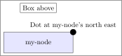

# Node basics - Place shapes and text with `\node`

`\node[] (my-node) {I am an arbitrary node text};`

`\node[draw] (placed-node) at (3, 3) {I am placed hard coded};`

# Useful arguments for node appearance

| argument | possible values | comment |
|:---------|:----------------|:--------|
| draw    | -               | Draw the border, just use \[draw\] |
| minimum height | integers | Give the node a minimum height independent of the text |
| minimum width | integers | Give the node a minimum width independent of the text |
| rounded corners | - | Give border rounded corners (in combination with draw) |
| rotate | integers | Rotate by so many degree |
| fill | any latex color | Fill the background with a latex color (use `fill=red!50` to scale brightness) |
| color | any latex color | Color the text and border |

# Anchors

A node has anchors which can be used in many ways for connecting nodes or position them.  
They can be simply accessed by `variable-name.anchor`

# Better node positioning

(hint: requires `\usetikzlibrary{positioning}` in your document preamble)

Directly place a node on an anchor  
`\node[draw, circle, fill=black, inner sep=3pt] (dot) at (my-node.north east) {Dot at my-node's north east};`

Relative placement (recommended)  
`\node[draw, above=1cm of my-node.north] (box-above) {Box above};`

# Useful arguments for node positioning

| argument | possible values | comment |
|:---------|:----------------|:--------|
| above/below/left/right    | of variable-name | Put element relative to variable-name |
| above/below/left/right    | Xpt of variable-name | Put element relative to variable-name by X units away (use cm, pt, em, etc) |
| above left/below left/above right, below left | same as above | you get the idea |
| anchor | anchor-point (west, east, etc) | which point of the new element should be taken as reference point |

