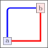

# Connecting basics - Draw arrows and lines

To simply draw an/line arrow from `a` to `b`

`\draw[->, line width=2pt] (a.east) -- (b.west);`

___

`\draw[<->, line width=2pt] (a.east) -- (b.west);`

___

`\draw[-, line width=2pt] (a.east) -- (b.west);`

___

`\draw[line width=2pt] (a.east) to[out=-30, in=150] (b.west);`

# Corners

Simply do corners (vertical first, then horizontal) by 

`\draw[line width=2pt, color=blue, rounded corners] (a.north) |- (b.west);`

or horizontal first, then vertical

`\draw[line width=2pt, color=red] (a.east) -| (b.south);`

# Chain

You can also simply chain arrows/lines

