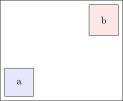
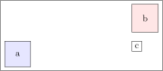

# Path basics

Paths are basic building blocks which are NOT visible.
There are many possibilites to combine path with other basic commands like `\node`, `\draw` or `\edge`.

# I use paths mainly for advanced positioning

(hint: requires `\usetikzlibrary{positioning, calc}` in your document preamble)

Imagine you want to position a node which is dependent on TWO other elements.
A new node `c` which should be on the same height as `a` but below `b`.




`\path` lets you do some coordinate magic:

```
\path let                          
        \p1 = (a.north east),  
        \p2 = (b.west),     
        in node[draw, anchor=north west] (c) at (\x2,\y1) {c}; 
```


`c` will now automatically move with both `a` and `b` when it changes position



___

You can use paths in so many varietys and combine them (in fact many commands are just shortcuts for `\path`,
that I will limit it to this useful command.
