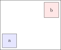
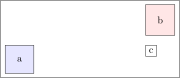

# Relative node positioning

Imagine you want to position a node which is dependent on TWO other elements.
A new node `c` which should be on the same height as `a` but below `b`.



You can use

```
\node[draw] (c) at (a-|b) {c};
```


`c` will now automatically move with both `a` and `b` when it changes position




## Small excursus: Paths

Paths are basic building blocks which are pretty self-explanatory.

```
\path [draw, color=red] (0,0) circle (1cm);
\path[draw] (0,0) -- (1,1)
           [rounded corners] -- (2,0) -- (3,1)
           [sharp corners] -- (3,0) -- (2,1);
```
gives


Many commands are just shortcuts for path:

| Command | Short for  |
|---------|------------|
| \draw   | \path[draw]|
| \fill   | \path[fill]|
| \filldraw   | \path[fill,draw]|
| \pattern   | \path[pattern]|
| \shade | \path[shade]|
| \shadedraw | \path[shade,draw]|
| \clip | \path[clip]|
| \useasboundingbox | \path[use as bounding box]|


# I use paths mainly for advanced positioning

(hint: requires `\usetikzlibrary{positioning, calc}` in your document preamble)


A not-visible `\path` lets you do solve the above problem as well:

```
\path let                          
        \p1 = (a.north east),  
        \p2 = (b.west),     
        in node[draw, anchor=north west] (c) at (\x2,\y1) {c}; 
```
