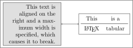
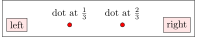
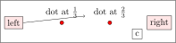

# Some more features of nodes

In this part we will take a look at text in nodes and positioning by calculations which are very handy.

# Text in nodes

There are multiple ways to enhance text. Besides many standard LaTeX elements you can use
out-of-the-box (like math or tables!). There are some things to look out for:

| argument | possible values | comment |
|:---------|:----------------|:--------|
| align    | left right center justify | align text (only when specified manual \\\\ line breaks work!) |
| text width | Xpt | Give the node a maximum width so it breaks automatically |

Here you can see two examples

```
\node[draw, fill=gray!25, minimum width=100pt, text width=80pt, align=right] (aligned-text) {
  This text is aligned on the right and a maximum width is specified, which causes it to break.};

    \node[draw, right=30pt of aligned-text] (table-text) {
        \begin{tabular}{cc}
            This & is a \\
            \midrule
            \LaTeX & tabular
        \end{tabular}
    };

    \draw[<->] (aligned-text) -- (table-text);
```




# Position by calculations

Sometimes you want to position (a node, an arrow start) between something at certain positions.
For example you want to have to 2 dots between two nodes



(hint: requires `\usetikzlibrary{positioning, calc}` in your document preamble)

You can use the tikzlibrary `calc` and this syntax:

```
    \node[draw] at ($(left)!0.33!(right)$) {};
    \node[draw] at ($(left)!0.66!(right)$) {};
```

This can also be used for `arrows` or `path let`

```
    \draw[->] (left.east) -- ($(left.north east)!0.5!(right.north west)$);
    \path let                          
        \p1 = (left.south),  
        \p2 = ($(left.east)!0.8!(right.north)$),     
        in node[draw, anchor=north west] (c) at (\x2,\y1) {c}; 
```

