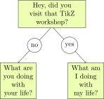

# Labelling Edges/Arrows/Lines

Edges often have a labels which gives bonus information like `no`/`yes` in this case.



In TikZ this is quite easy by just appending a normal `node` to an arrow command.

```
    \draw[->] (question.south) -- (no.north) node[midway] {no};
    \draw[->] (question.south) -- (yes.north) node[midway] {yes};
```

# Useful parameters

| argument | comment |
|:---------|:--------|
| pos=0.X | create at percentage of line length |
| start | create at start (or pos=0) |
| end | create at end (or pos=1 etc.) |
| midway | create at the middle |
| above | text is above line |
| below | text is below line |
| sloped | text has same angle as line |
| near start/end | more possibilities |
| very near start/end | more possibilities |

